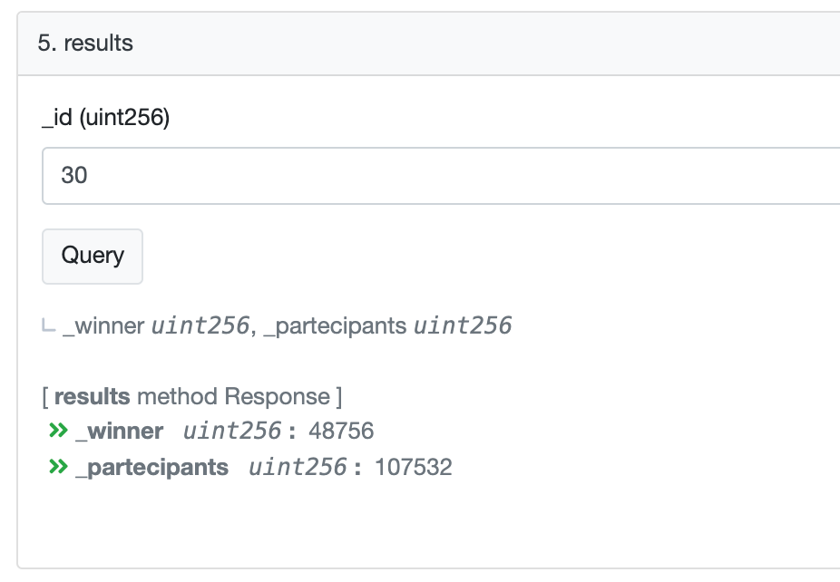

# OVRLand Monthly ChainLink Extraction

## Contract Address: [0xcb0e2493f2d014fa0f10a62ec7ce06cb32efcbb9](https://polygonscan.com/address/0xcb0e2493f2d014fa0f10a62ec7ce06cb32efcbb9)

To view the results on Polygonscan click on "Read Contract" and scroll down to tab number 5 "Result" and enter the draw number.



## Smart Contract Source Code

Randomness is very difficult to generate on blockchains. The reason for this is because every node must come to the same conclusion, forming a consensus. There's no way to generate random numbers natively in smart contracts, which is unfortunate because they can be very useful for a wide range of applications.


Chainlink VRF (Verifiable Random Function) is a provably-fair and verifiable source of randomness designed for smart contracts. Smart contract developers can use Chainlink VRF as a tamper-proof RNG to build reliable smart contracts for any applications which rely on unpredictable outcomes:

- Blockchain games and NFTs
- Random assignment of duties and resources (e.g. randomly assigning judges to cases)
- Choosing a representative sample for consensus mechanisms

Chainlink VRF enables smart contracts to access randomness without compromising on security or usability. With every new request for randomness, Chainlink VRF generates a random number and cryptographic proof of how that number was determined. The proof is published and verified on-chain before it can be used by any consuming applications. This process ensures that the results cannot be tampered with nor manipulated by anyone, including oracle operators, miners, users and even smart contract developers.

Here how OVR uses Chainlink [VRFConsumerBase](https://github.com/smartcontractkit/chainlink/blob/develop/contracts/src/v0.6/VRFConsumerBase.sol) Contract:

```solidity
// SPDX-License-Identifier: MIT
pragma solidity 0.8.7;

import "@chainlink/contracts/src/v0.8/VRFConsumerBase.sol";
import "@openzeppelin/contracts/access/Ownable.sol";

contract RandomWinner is VRFConsumerBase, Ownable {
    bytes32 internal keyHash;
    uint256 internal fee;
    uint256 public id = 0;

    mapping(uint256 => uint256) public partecipants;
    mapping(uint256 => uint256) public draw;

    /**
     * Constructor inherits VRFConsumerBase
     *
     * Network: Polygon Mainnet
     * Chainlink VRF Coordinator address: 0x3d2341ADb2D31f1c5530cDC622016af293177AE0
     * LINK token address:                0xb0897686c545045aFc77CF20eC7A532E3120E0F1
     * Key Hash: 0xf86195cf7690c55907b2b611ebb7343a6f649bff128701cc542f0569e2c549da
     */
    constructor()
        VRFConsumerBase(
            0x3d2341ADb2D31f1c5530cDC622016af293177AE0, // VRF Coordinator
            0xb0897686c545045aFc77CF20eC7A532E3120E0F1 // LINK Token
        )
    {
        keyHash = 0xf86195cf7690c55907b2b611ebb7343a6f649bff128701cc542f0569e2c549da;
        fee = 0.0001 * 10**18; // 0.0001 LINK (Varies by network)
    }

    function setPartecipants(uint256 _partecipants) internal {
        partecipants[id] = _partecipants;
    }

    function results(uint256 _id)
        public
        view
        returns (uint256 _winner, uint256 _partecipants)
    {
        return (draw[_id], partecipants[_id]);
    }

    /**
     * Requests randomness
     */
    function getRandomNumber(uint256 _partecipants)
        public
        onlyOwner
        returns (bytes32 requested)
    {
        setPartecipants(_partecipants);
        require(LINK.balanceOf(address(this)) >= fee, "Not enough LINK");
        return requestRandomness(keyHash, fee);
    }

    /**
     * Callback function used by VRF Coordinator
     */
    function fulfillRandomness(bytes32 requestId, uint256 randomness)
        internal
        override
    {
        draw[id] = (randomness % partecipants[id]) + 1;
        id++;
    }
}

```